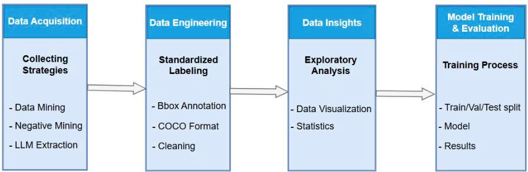
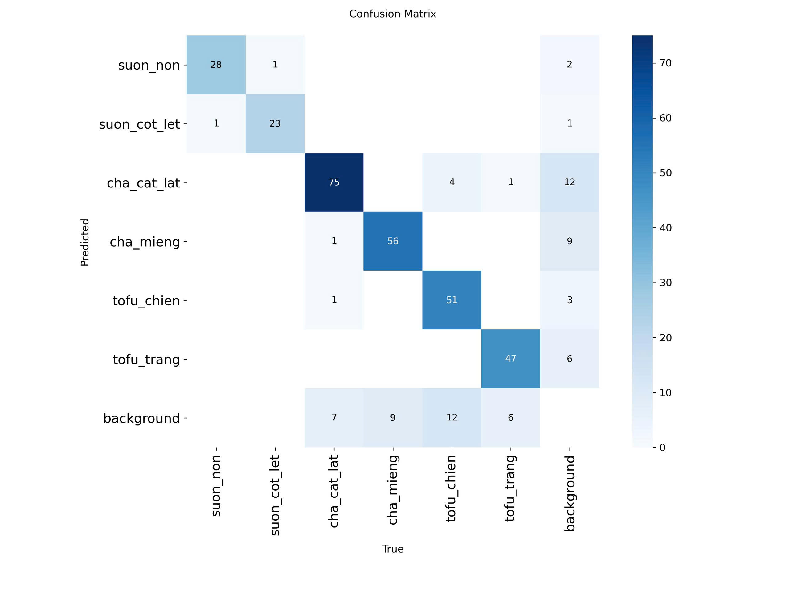
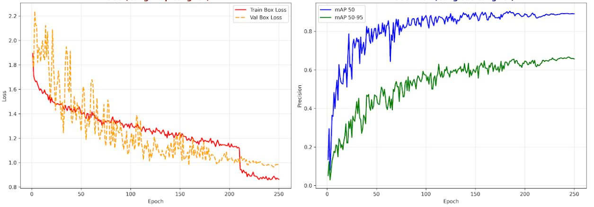
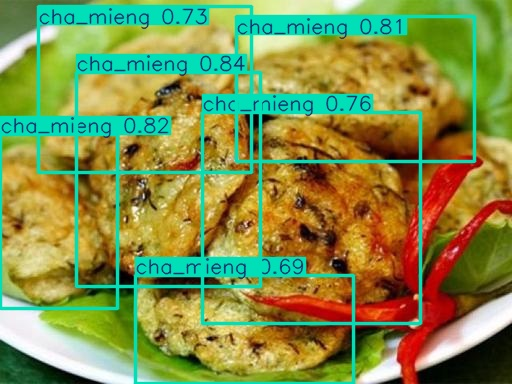
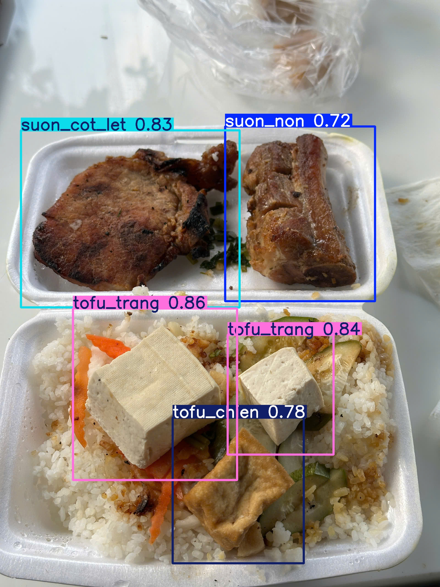
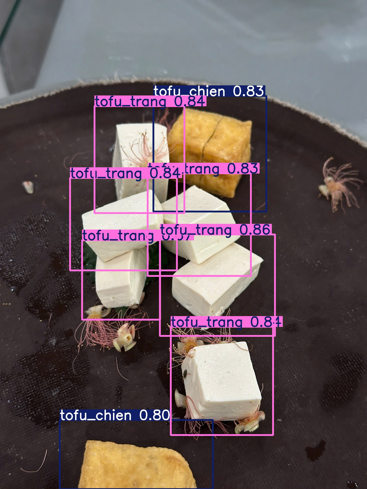

# Food Detection & Analysis System with VLM Enrichment 🍱

This project focuses on building a comprehensive pipeline for food detection, leveraging Vision-Language Models (VLM) to enrich dataset metadata and deploying a demonstration system.

## 📂 Project Structure

This repository is organized into specific notebooks tackling different stages of the MLOps pipeline:



### 1. Data Preparation & Enhancement
- **`Vison_LLM_Prompt.ipynb`**: Utilizes a Vision-Language Model (VLM) to extract rich metadata and context from food images, enhancing the dataset beyond simple class labels.
- **`Preprocess_annotation.ipynb`**: Handles COCO format cleaning, performs **stratified splitting** (Train/Val/Test) to ensure class balance, and integrates negative background samples to reduce False Positives.
- **`Data_Exploration.ipynb`**: Visualizes the distribution of food attributes and class imbalances across the merged and separated datasets.

### 2. Modeling & Training
- **`Train.ipynb`**: Contains the training loop, loss visualization, and evaluation metrics (mAP, Confusion Matrix) on the test set.

### 📊 Evaluation Results

The model achieved outstanding performance on the validation set with an overall **mAP@50 of 0.929**.

| Class | Precision | Recall | mAP@50 | mAP@50-95 |
| :--- | :---: | :---: | :---: | :---: |
| **ALL CLASSES** | **0.928** | **0.825** | **0.929** | **0.664** |
| 🍖 Suon Non | 0.919 | **0.931** | **0.976** | 0.601 |
| 🥩 Suon Cot Let | 0.973 | 0.917 | 0.953 | 0.715 |
| 🍥 Cha Cat Lat | 0.901 | 0.871 | 0.923 | 0.663 |
| 🍘 Cha Mieng | 0.921 | 0.708 | 0.885 | 0.596 |
| 🍤 Tofu Chien | **0.979** | 0.710 | 0.931 | **0.768** |
| 🧊 Tofu Trang | 0.876 | 0.815 | 0.905 | 0.643 |

> **Key Highlights:**
> - **Exceptional Accuracy:** The system reached **92.9% mAP@50**, proving its reliability in detecting Vietnamese food items.
> - **Best Performer:** "Suon Non" (Young Ribs) achieved the highest detection rate with **97.6% mAP**.
> - **High Precision:** "Tofu Chien" achieved **97.9% Precision**, minimizing false positives effectively.

<br>

### 📈 Training Analysis & Visualizations

<div align="center">
  
  
</div>
<p align="center">
  <em>Figure 2: Confusion Matrix (left) and Training Metrics over epochs (right).</em>
</p>

<br>

### 🖼️ Sample Detections

<p align="center">
  
  <br><br>
  
  <br><br>
  
</p>

### 3. Deployment
- **`Final_System.ipynb`**: A deployment demo script that launches the model inference server using **ngrok** for remote access.

## 🛠️ Tech Stack
- **Platform**: Google Colab
- **Core**: Python, PyTorch, NumPy, Pandas
- **Computer Vision**: YOLOV11
- **VLM**: Qwen/Qwen2-VL-7B-Instruct
- **Tools**: Matplotlib (Visualization), Ngrok (Tunneling)

## 🚀 How to Run
1. Clone the repository (Should be implemented on Google Colab).
2. Install dependencies:
   ```bash
   pip install -r requirements.txt